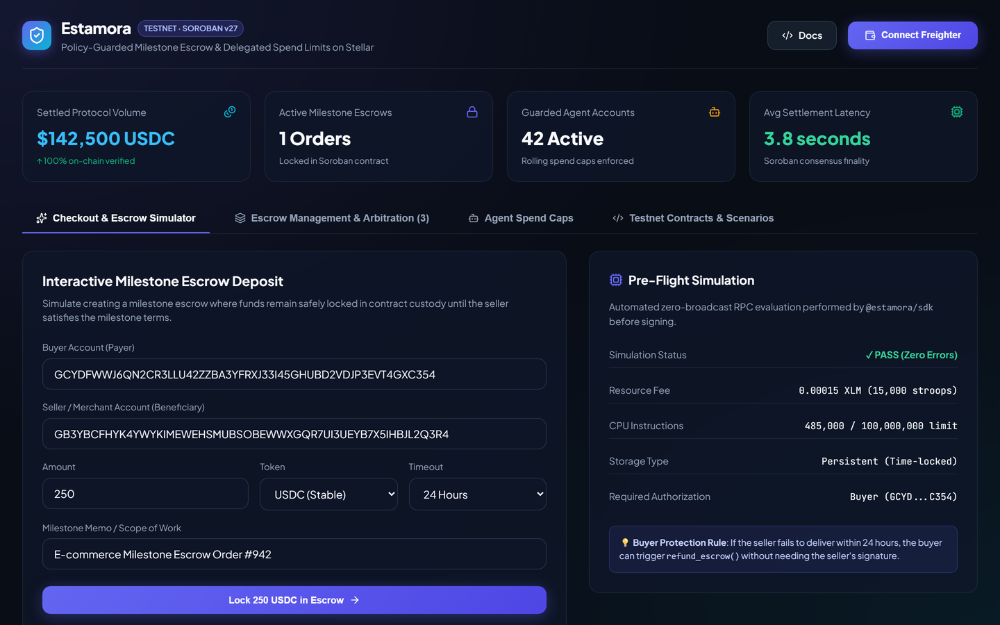
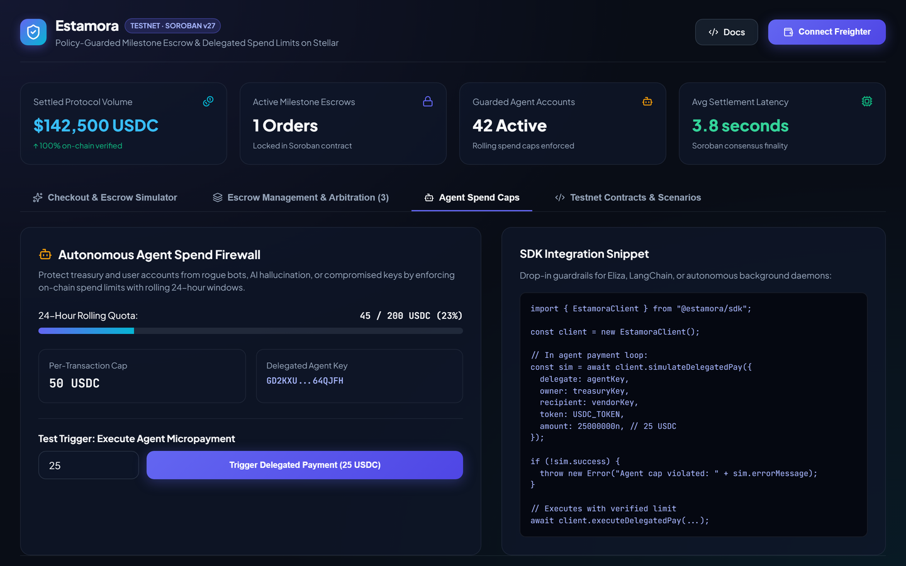
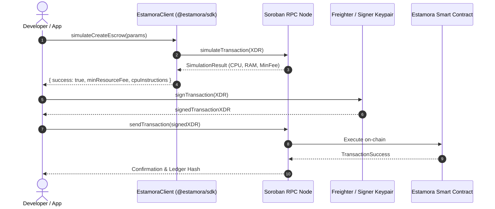

# @estamora/sdk

[](https://github.com/Estamora-Soroban-Layers/estamora-sdk/actions/workflows/ci.yml)
[](https://npmjs.com)
[](LICENSE)
[](https://www.typescriptlang.org/)

> **Isomorphic TypeScript client SDK, zero-broadcast pre-flight simulation engine, and integration layer for the Estamora Payment Protocol on Stellar (Soroban).**

Part of the **Estamora Payment Protocol**:
- 📜 **[estamora-contracts](https://github.com/Estamora-Soroban-Layers/estamora-contracts)** — Soroban smart contracts in Rust.
- ⚡ **[estamora-sdk](https://github.com/Estamora-Soroban-Layers/estamora-sdk)** — TypeScript client SDK (this repository).
- 💻 **[estamora-app](https://github.com/Estamora-Soroban-Layers/estamora-app)** — Merchant dashboard, checkout simulator, and Freighter operator console ([Live App](https://estamora-app.vercel.app)).
- 📚 **[estamora-docs](https://github.com/Estamora-Soroban-Layers/estamora-docs)** — Technical documentation hub ([Live Docs](https://estamora-docs.vercel.app)).

---

## Product In Action & SDK Simulation

The SDK provides developer-first tooling for evaluating, simulating, and invoking Estamora escrow and payment workflows without blind broadcasts.

### Zero-Broadcast Pre-Flight Simulation & Scorecards
Simulate contract invocations before prompting user wallet signatures, calculating exact CPU instructions, memory allocations, and refundable resource fees.



### Delegated Spend Cap Policies for AI Agents & Services
Enforce and inspect rolling 24-hour spend quotas and per-transaction limits on secondary accounts directly through client bindings.



---

## Core Capabilities

1. **Pre-Flight RPC Simulation Engine**: Performs automated preflight checks against Soroban RPC nodes (`simulateTransaction`) to estimate resource fees and detect failures before wallet interaction.
2. **Strongly Typed Interfaces**: Complete TypeScript type definitions for every contract method, escrow state payload, milestone release, and dispute resolution event.
3. **Structured Error Diagnostics**: Translates low-level Soroban contract revert codes into clear, human-readable exceptions with actionable recovery guidance.
4. **Isomorphic Runtime Support**: Runs seamlessly in modern browser environments (with Freighter, xBull, or Albedo) and Node.js backend services.

---

## SDK Architecture & Flow



---

## Installation

```bash
npm install @estamora/sdk @stellar/stellar-sdk
```

---

## Quickstart & Code Examples

### 1. Initialize Client
```typescript
import { EstamoraClient } from "@estamora/sdk";

// Automatically configures Testnet RPC and deployed contract ID
const client = new EstamoraClient({
  network: "testnet",
  contractId: "CADQOBYHA4DQOBYHA4DQOBYHA4DQOBYHA4DQP5KR",
  rpcUrl: "https://soroban-testnet.stellar.org",
});
```

### 2. Pre-Flight Simulation (Zero-Gas Inspection)
```typescript
const sim = await client.simulateCreateEscrow({
  buyer: "GCYDFWWJ6QN2CR3LLU42ZZBA3YFRXJ33I45GHUBD2VDJP3EVT4GXC354",
  seller: "GB3YBCFHYK4YWYKIMEWEHSMUBSOBEWWXGQR7UI3UEYB7X5IHBJL2Q3R4",
  token: "CDLZFC3SYJYDZT7K67VZ75HPJVIEUVNIXF47ZG2FB2RMQQVU2HHGCYSC", // XLM or USDC
  amount: "10000000", // 1.0 XLM (in stroops)
  timeoutSeconds: 86400, // 24 hours
  memo: "Milestone Delivery #104",
});

if (!sim.success) {
  console.error("Simulation failed:", sim.errorMessage);
  return;
}

console.log(`Estimated fee: ${sim.minResourceFee} stroops`);
console.log(`CPU instructions: ${sim.cpuInstructions}`);
```

### 3. Delegated Agent Spend Checks
```typescript
const agentSim = await client.simulateDelegatedPay({
  delegate: "GD2KXUTFHTRJM7VQJRYV3FWWKMN6TNM6GPCLMQH74BZSQYEKYR64QJFH",
  owner: "GCYDFWWJ6QN2CR3LLU42ZZBA3YFRXJ33I45GHUBD2VDJP3EVT4GXC354",
  recipient: "GB3YBCFHYK4YWYKIMEWEHSMUBSOBEWWXGQR7UI3UEYB7X5IHBJL2Q3R4",
  token: "CBLQLJAG72M4XQRJMQHSKYIFVHQD7LNTNOQH2GRMCMBWMSLBSLTGTJC7",
  amount: "5000000", // 0.5 USDC
});

if (agentSim.success) {
  console.log("Delegated payment approved under active quota!");
}
```

### 4. Human-Readable Error Decoding
```typescript
import { decodeErrorCode } from "@estamora/sdk";

const error = decodeErrorCode(10);
console.log(error.mnemonic); // "PER_TX_CAP_EXCEEDED"
console.log(error.message);  // "Transaction amount exceeds authorized per-transaction spend limit."
console.log(error.recovery); // "Reduce payment amount or request an increase in per-transaction cap."
```

---

## Error Catalog Reference

| Code | Mnemonic | Description | Actionable Recovery |
| :---: | :--- | :--- | :--- |
| `1` | `NOT_INITIALIZED` | Contract uninitialized | Deployer must run `initialize(admin)`. |
| `2` | `ALREADY_INITIALIZED` | Re-initialization rejected | Contract state is immutable once initialized. |
| `3` | `UNAUTHORIZED` | Caller lacked authorization | Ensure caller holds valid cryptographic key. |
| `4` | `INVALID_AMOUNT` | Amount must be greater than zero | Specify an integer balance > 0. |
| `5` | `ESCROW_NOT_FOUND` | Escrow ID not registered | Verify escrow ID on ledger. |
| `6` | `ESCROW_NOT_ACTIVE` | Escrow already released/refunded | Check escrow lifecycle status. |
| `7` | `TIMEOUT_NOT_ELAPSED`| Auto-refund attempted prematurely | Await timeout timestamp before refund. |
| `8` | `INVALID_SPLIT` | Dispute percentages do not equal 100% | Ensure buyer_pct + seller_pct == 100. |
| `9` | `SPEND_CAP_NOT_FOUND`| No active delegation found | Register spend cap before executing payments. |
| `10`| `PER_TX_CAP_EXCEEDED`| Payment exceeds per-tx limit | Lower transaction amount to fit quota. |
| `11`| `DAILY_CAP_EXCEEDED` | 24h rolling limit exhausted | Await window reset or increase daily cap. |

---

## Build & Test Instructions

```bash
# Install dependencies
npm install

# Run automated test suites (8/8 passing)
npm test

# Compile ESM and CommonJS bundles
npm run build
```

---

## License

Licensed under the Apache License, Version 2.0. See [LICENSE](LICENSE) for details.
